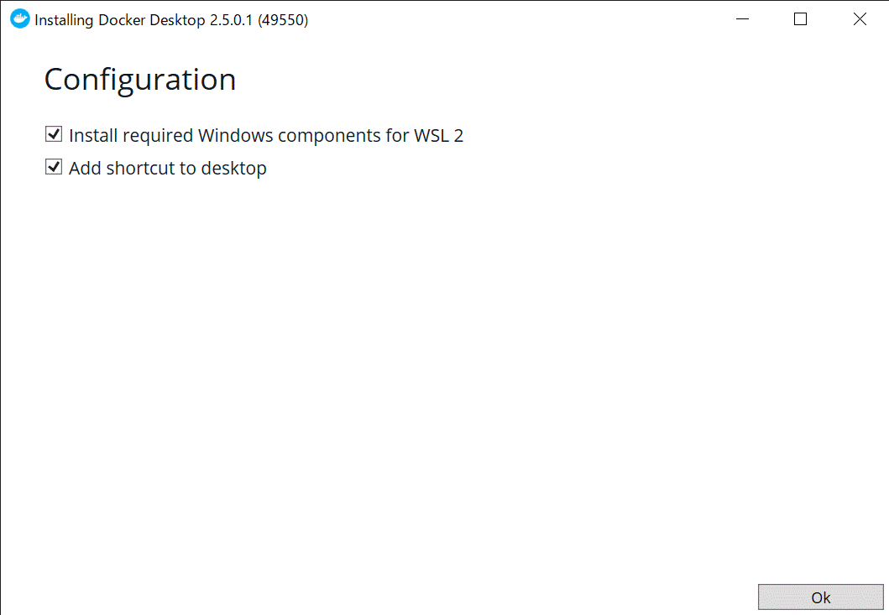
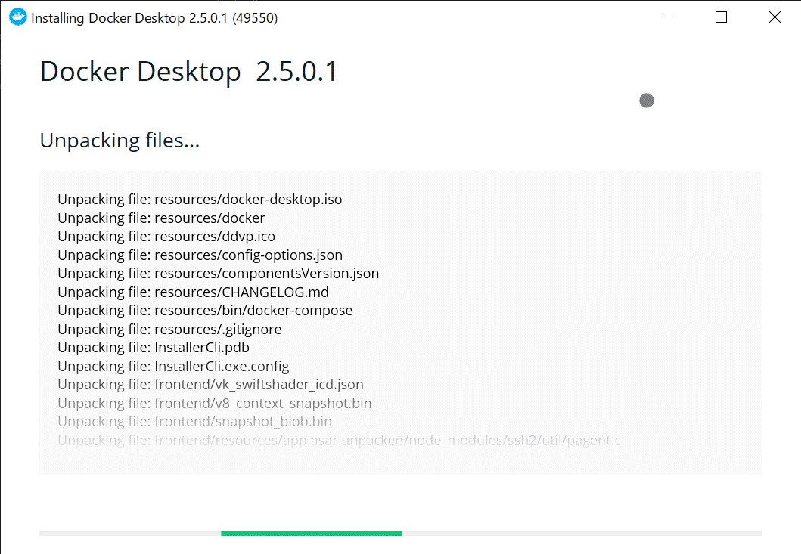

# Windows上でのDocker開発環境の構築手順
https://docs.docker.com/docker-for-windows/install/

1. https://hub.docker.com/editions/community/docker-ce-desktop-windows/ から「Stable」のインストーラーをダウンロードする
2. ダウンロードしたインストーラーを起動する
3. ダイアログにしたがってインストールする。    (Add shortcut to desktopは、私は外しました…デスクトップはきれいにしたいのだ)    
4. 「Close and restart」を押すと、Windowsが再起動をします

再起動後、「WSL2が古いんだが？」と聞かれるかもしれません。その時は「 https://docs.microsoft.com/ja-jp/windows/wsl/wsl2-kernel 」から手動で更新する必要があります。
